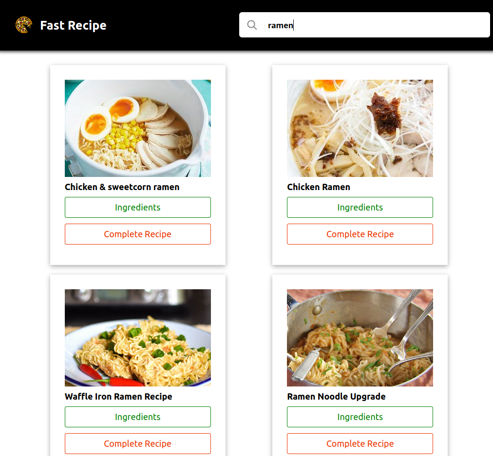

# <p align="center"> Fast Recipe </p>

## Table of Content

- [Introduction](#introduction)
- [Environment](#environment)
- [Installation](#installation)
- [Usage](#usage)
- [Galleries](#Galleries)
- [Authors](#authors)
- [License](#license)

# Introduction

Fast Recipe is a user friendly web application that allow users to search for cooking or cockails recipe

This project was created by:

- [Michael Mbea](https://www.linkedin.com/in/michael-mbea-8032a0103/)


# Usage
Use Web app to search for recipe

# Environment

This project is interpreted/tested on Kubuntu 20.04 LTS using React(Version 17.0.2), Axios(Version 0.21.1, styled-components(Version 5.3.0"), Material UI(Version 4.11.4)

# Installation

### Requirements:

  -Nodejs 16.13.0 LTS
  -Npm or Npx

-Clone this repository on your Pc
-Open your terminal and run
```
sh
npm insall 
```
to install the package

```
sh
npm start
```
to start a development server


# Galleries


# License

Free To use
[MIT]

This project was made as an End Of Year Project at Holberton School


  
